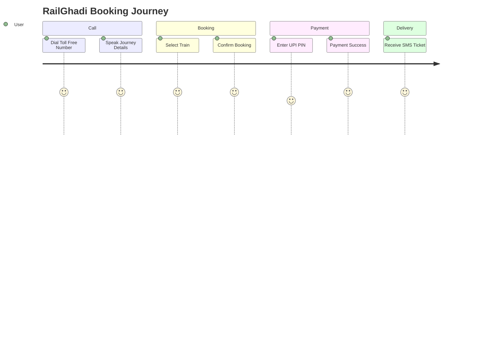
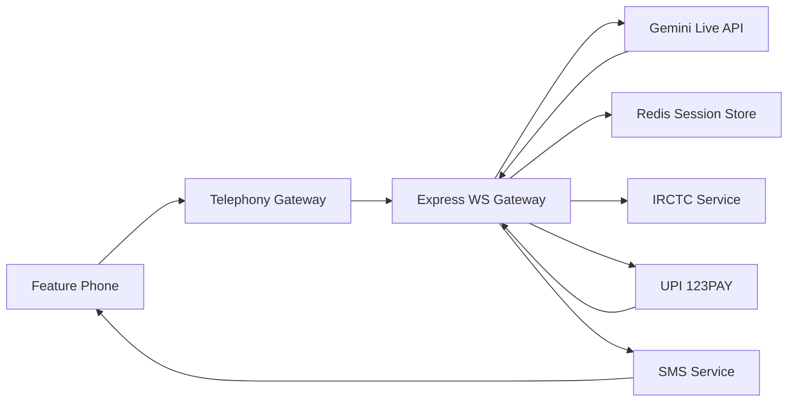
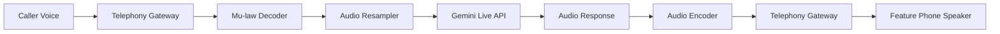
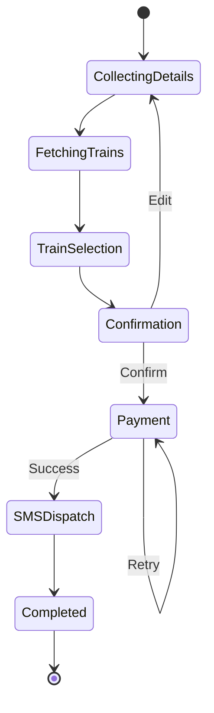
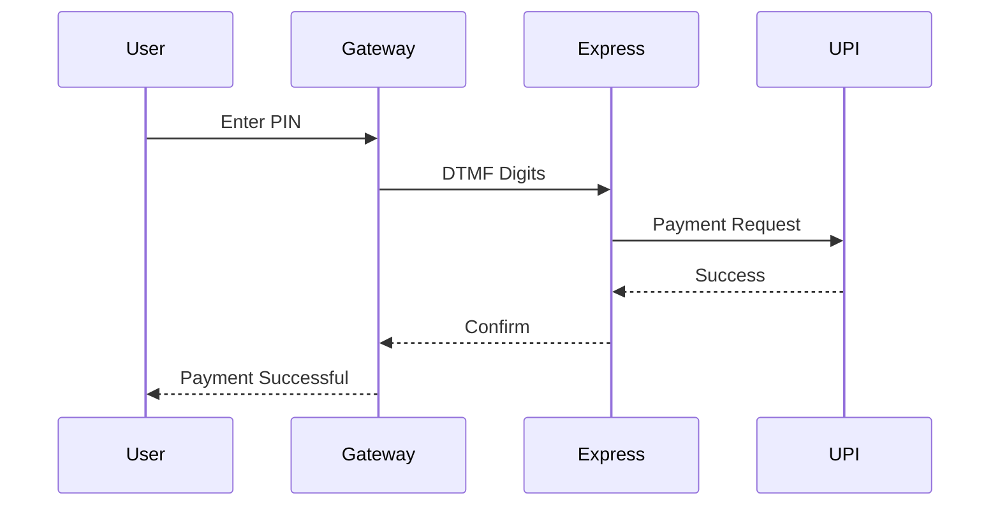
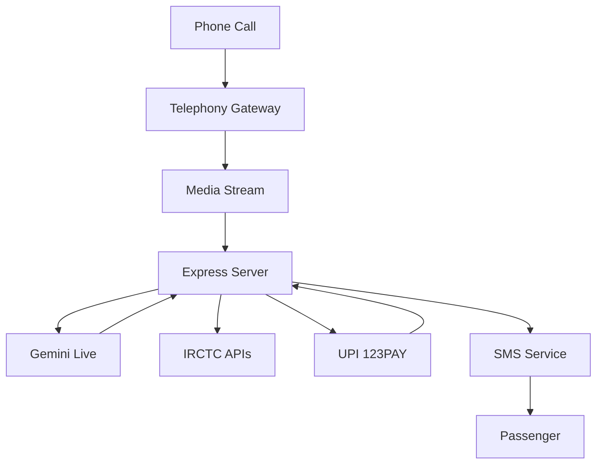
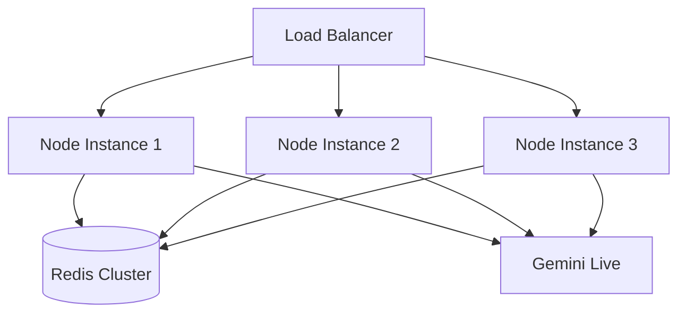

# RailGhadi

## 🚂 Voice-First Telephony & Offline Train Booking Platform

Book train tickets with a phone call. No smartphone. No internet. No app. Just your voice.

---

## 📖 Table of Contents

- Vision & Problem Statement
- User Journey
- System Architecture
- Audio Pipeline
- State Machine
- Payment Flow
- End-to-End Data Flow
- Tech Stack
- Security
- Project Structure
- Scaling

---

## 🎯 Vision & Problem Statement

RailGhadi enables feature-phone users to book train tickets using a simple phone call.

---

## 💡 User Journey



---

## 🏗️ System Architecture



---

## 🔊 Audio Pipeline



---

## 🔄 Conversational State Machine



---

## 💳 DTMF Payment Flow



---

## 📊 Complete Data Flow



---

## 🛠️ Tech Stack

- Node.js + Express
- Gemini Live API
- Twilio / Plivo
- Redis
- PostgreSQL
- UPI 123PAY
- Docker
- Kubernetes

---

## 🔐 Security

- TLS secured WebSockets
- Isolated DTMF handling
- Redis session isolation
- No voice recording storage
- PCI compliant payment flow

---

## 📁 Project Structure

```text
railghadi/
├── src/
├── routes/
├── lib/
├── config/
├── db/
├── docker/
├── k8s/
├── tests/
└── README.md
```

---

## 📈 Scaling Architecture


